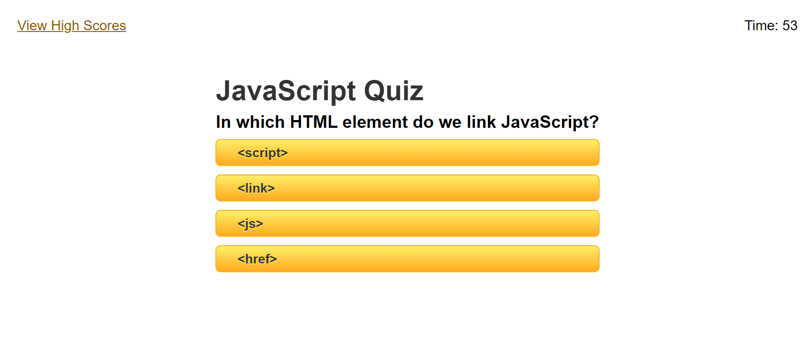
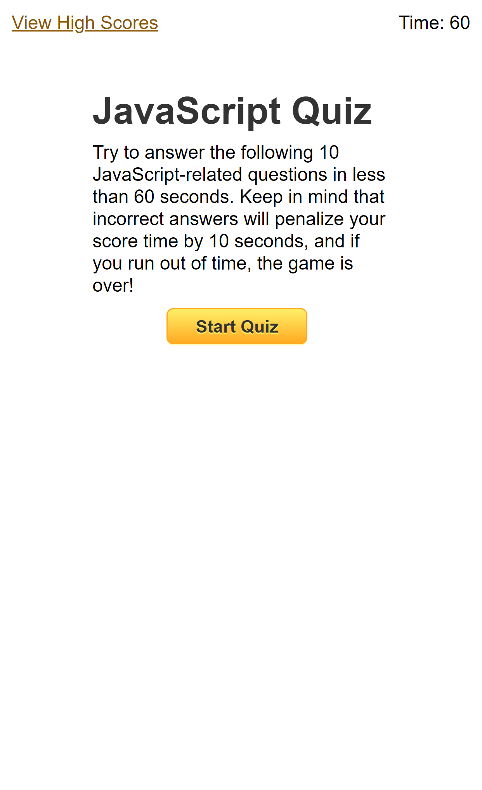

# JavaScript Quiz

## Overview and Functionality

This is a timed quiz with 10 JavaScript-related questions to test your knowledge against the clock!

When the page loads, you are given the rules: 10 questions in 60 seconds! Each incorrect answer deducts 10 seconds from the time left, and if you run out of time, the game is over. 

When you click the Start button, the countdown begins. Each question is multiple choice with buttons displaying the possible answers. 

Correct answers will display 'Correct!' while incorrect answers will dock 10 seconds from your time and the correct answer will be displayed for a second below the choices.

If the timer reaches 0 or you reach the end of the quiz, you'll be prompted to enter your initials and save your score, which will bring you to the High Scores page, where you can see the high scores saved on your local device. 

Click 'Go Back' to try again, or 'Clear Scores' to erase a score you wouldn't want your professor to see.

## Behind the Scenes

This quiz utilizes mostly vanilla JavaScript, with a few lines of JQuery to collect and parse local saved data to keep track of scores. 

I kept the CSS styling simple so the quiz taker isn't distracted, and kept the color scheme consistent across the different pages. 

Media queries keep the quiz looking good even on mobile devices!

## Layout

Desktop Layout:

Mobile Layout:

## Link to the Deployed Page

